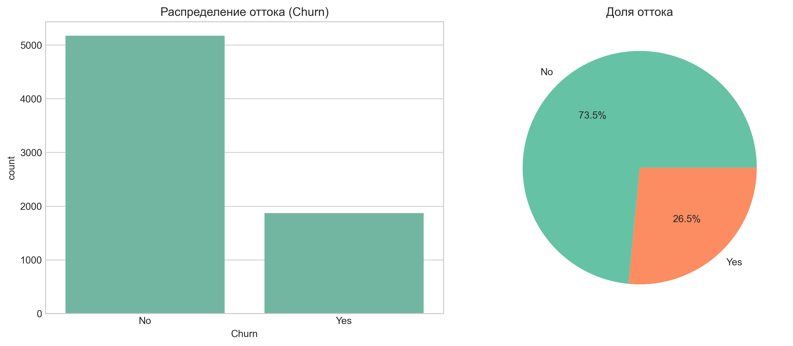
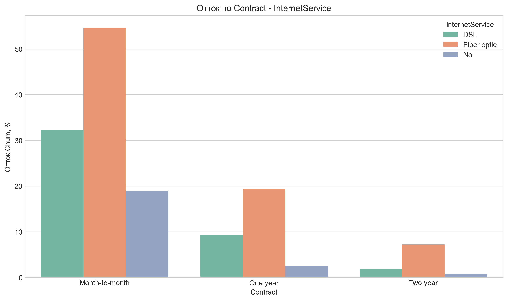
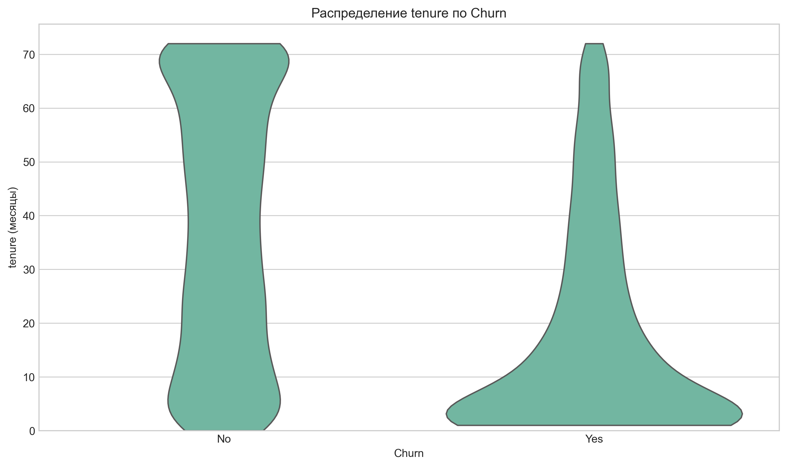
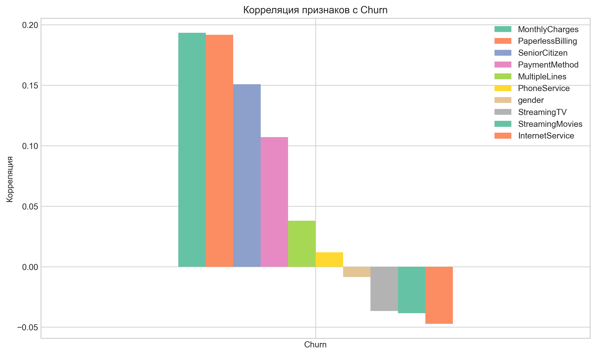
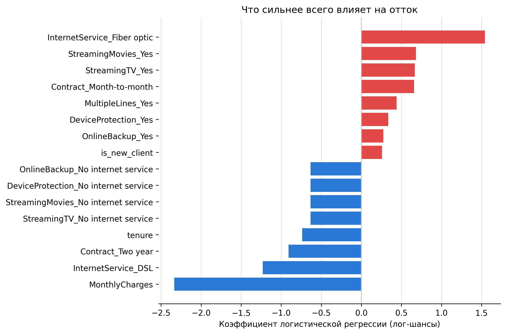

# customer-churn-prediction

Предсказание оттока клиентов телеком-оператора (датасет [Telco Customer
Churn](data/Telco-Customer-Churn.csv), 7043 клиента, 21 признак) по данным об
использовании услуг и типе контракта.

## Структура проекта

```
data/                     сырые и обработанные данные
models/                   preprocessor.joblib, churn_model.joblib, metrics.json
images/                   графики EDA и интерпретации модели
notebooks/                01_eda.ipynb, 02_preprocessing.ipynb
src/customer_churn_prediction/
    preprocessing.py      очистка данных, feature engineering, ColumnTransformer
    models.py             обучение, тюнинг, интерпретация, предсказание
tests/                    pytest-тесты для preprocessing.py и models.py
```

## Результаты EDA

### Распределение целевой переменной Churn


### Отток по типу контракта


### Распределение срока обслуживания


### Корреляции признаков


Ключевые находки: отток — 26.5% клиентов; помесячный контракт (Month-to-month)
уходит в ~15 раз чаще двухлетнего; новые клиенты (tenure < 12 мес.) уходят
почти в 3 раза чаще старых; Fiber optic без OnlineSecurity и оплата через
Electronic check — дополнительные факторы риска.

## Препроцессинг

`src/customer_churn_prediction/preprocessing.py`:
- `clean_data` — приводит `TotalCharges` к числу, заполняет 11 пропусков как `tenure * MonthlyCharges`;
- `add_features` — добавляет `is_new_client` (`tenure < 12`);
- `build_preprocessor` — `ColumnTransformer`: числовые признаки (импутация медианой + `StandardScaler`), категориальные (импутация most-frequent + `OneHotEncoder`);
- `run_pipeline` — прогоняет всё целиком и сохраняет `preprocessor.joblib` и `X/y_train/test_processed`.

## Модели и метрики

Три модели обучены на одних и тех же `X_train_processed`/`y_train_processed`
с `class_weight="balanced"` (отток — миноритарный класс, 26.5%):

| Модель | ROC-AUC | PR-AUC | Recall (Churn) |
|---|---|---|---|
| Logistic Regression | 0.841 | 0.630 | 0.79 |
| Random Forest | 0.822 | 0.606 | 0.48 |
| Gradient Boosting (HistGB) | 0.835 | 0.648 | 0.75 |
| **Logistic Regression (tuned)** | **0.840** | 0.623 | 0.78 |

**Выбрана Logistic Regression** — не только за лучший ROC-AUC, но и за
recall на классе Churn: для задачи удержания клиентов дороже пропустить
уходящего клиента, чем ошибочно предложить скидку тому, кто остался бы
и так. Подбор гиперпараметров (`GridSearchCV` по `C` и `l1_ratio`, 5-fold CV
по ROC-AUC) не дал значимого прироста — лучшие параметры (`C=100`, `l1_ratio=0`)
оказались близки к дефолтным, модель и так была близка к оптимуму на этих
данных.

Полные метрики (classification report по каждой модели) — в `models/metrics.json`.

## Интерпретация модели



Топ факторов риска (увеличивают отток): `InternetService_Fiber optic`,
`Contract_Month-to-month`, `is_new_client`, `PaymentMethod_Electronic check` —
всё согласуется с находками EDA. Топ защитных факторов: `Contract_Two year`,
`tenure`, `InternetService_DSL`, `MonthlyCharges`.

*Нюанс интерпретации:* признаки вида `..._No internet service`
(`DeviceProtection`, `OnlineBackup`, `StreamingTV`, `StreamingMovies`) тоже
попадают в защитные факторы, но это артефакт кодирования (клиенты без
интернета физически не могут иметь эти опции), а не причинная связь.

## Предсказание оттока для нового клиента

```python
from customer_churn_prediction.models import predict_churn

predict_churn({
    "gender": "Female",
    "SeniorCitizen": 0,
    "Partner": "No",
    "Dependents": "No",
    "tenure": 2,
    "PhoneService": "Yes",
    "MultipleLines": "No",
    "InternetService": "Fiber optic",
    "OnlineSecurity": "No",
    "OnlineBackup": "No",
    "DeviceProtection": "No",
    "TechSupport": "No",
    "StreamingTV": "No",
    "StreamingMovies": "No",
    "Contract": "Month-to-month",
    "PaperlessBilling": "Yes",
    "PaymentMethod": "Electronic check",
    "MonthlyCharges": 70.35,
    "TotalCharges": "140.7",
})
#    churn_probability churn_prediction
# 0            0.866326              Yes
```

Также принимает список словарей или `pandas.DataFrame` (для нескольких
клиентов сразу — если есть колонка `customerID`, она сохраняется в результате).

## Как воспроизвести

```bash
pip install -e .
python -m customer_churn_prediction.preprocessing   # EDA -> clean_data.csv, result_data.csv, preprocessor.joblib
python -m customer_churn_prediction.models          # обучение, сравнение моделей, churn_model.joblib, metrics.json
pytest                                              # 11 тестов на preprocessing.py и models.py
```
